# Henrique Christ Bergami

**Full Stack Developer** — from mobile to infra, from API to dashboard

---

## Who I am

Full Stack Developer with **4+ years** of experience, front-end focused but comfortable at any layer of the stack. I've built complete systems from scratch — authentication, APIs, admin dashboards, mobile apps — and shipped all of it to production.

Beyond development, I'm familiar with infra: Docker, Nginx, VPS deployments, environment setup. Not a DevOps engineer, but I know my way around. Currently studying cybersecurity, because whoever knows how to build also needs to understand how things break.

> *"If you can't explain it simply, you don't understand it well enough."*
> — Albert Einstein

---

*And as my most beloved book once said...*

 

*"All grown-ups were once children — but only few of them remember it."* 
— Antoine de Saint-Exupéry, The Little Prince

 

*"It is madness to throw away all chances of happiness because one attempt did not work out."* 
— Antoine de Saint-Exupéry, The Little Prince

---

## Stack

### Front-end

### Back-end

### Database

### DevOps & Infra

---

## Favorite project

### 📖 [Mahou Reader](https://mahoureader.com)

My first real project — born during college and the one I care about the most to this day. I started from scratch without really knowing where it was going, and it grew alongside me. Little by little I plan to improve it, clean up the code, and maybe open it up to the community as open source.

A web novel and light novel reading platform with an optimized reader, advanced search, EPUB download, individual reading progress, and a full admin panel. Custom image server (a handcrafted mini S3) with Express.js, containerized deployment with Docker + Portainer, and Nginx as reverse proxy.

---

## GitHub Stats

---

*Portuguese (native) · English (intermediate) · Spanish (basic)*

